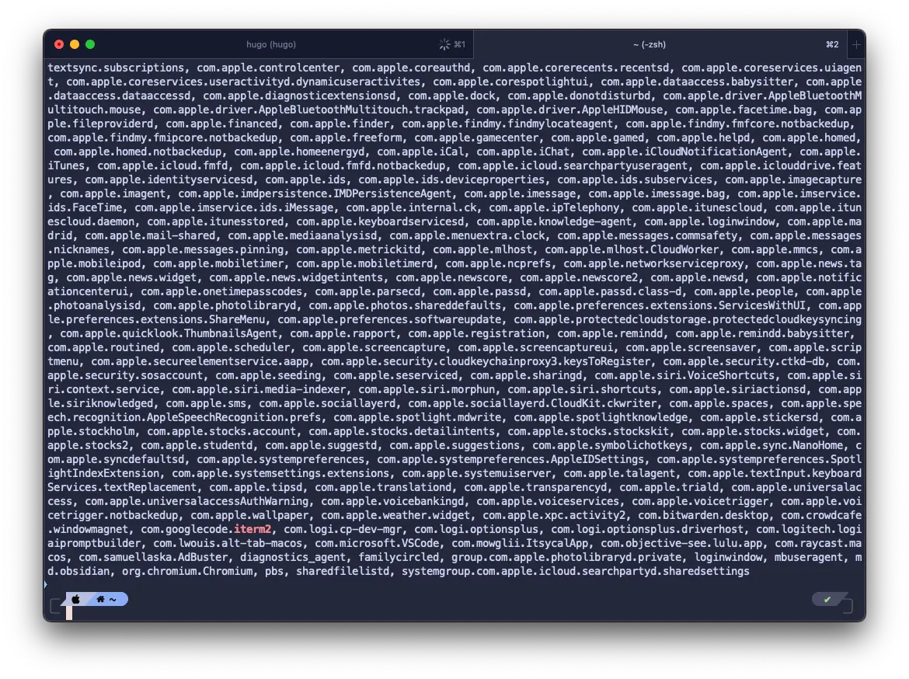

If you checked out my post on [Terminal Setup]( "Terminal Setup"), this is a follow-up to that. I’ve gone through several iterations of setting it up on both my personal and work laptops, and honestly, it’s not as fun the second time around. Since automation is my thing, in this tutorial, we’ll automate the whole terminal setup process using the following tools:
* GNU Stow
* MAS
* MacOS defaults and PlistBuddy

If you want to know more about these awesome tools, then read on!

## GNU Stow
[GNU Stow](https://www.gnu.org/software/stow/) is a symlink manager. A symlink (short for symbolic link) is a type of file in Unix-like OS that serves as a reference to another file (similar to a shortcut file in Windows). GNU Stow will help manage our dotfiles/config files (like .zshrc and .p10k.zsh) so that we can store the actual config files in a different location and create a symlink in our home directory (since the system expects dotfiles to exist there). This allows us to compile all our config files and version control it using git and upload it on github as a bragging right.

The idea is to create a folder in our home directory (I’ll name mine `.dotfiles`) where we’ll store all our config files. Then, we’ll invoke the stow command to create the symlinks for us. The stow command expects a specific file directory format, as shown below:
```
~/dotfiles/
├── zsh/
│   └── .zshrc
├── p10k/
│   └── .p10k.zsh
```

Some dev tools have more complex config locations, such as `vim` or `neovim`, which store their config files inside `~/.config/`. In these cases, structure the dotfiles folder like this:
```
~/dotfiles/
├── zsh/
│   └── .zshrc
├── git/
│   └── .gitconfig
├── p10k/
│   └── .p10k.zsh
├── vim/
│   ├── .vimrc
│   └── .vim/
│       ├── plugins/
│       └── colors/
└── nvim/
    └── .config/
        └── nvim/
            └── init.vim
```

## GNU Stow: Step-by-Step
1. Install GNU Stow via homebrew `brew install stow`
2. Create your directories `mkdir -p ~/.dofiles/zsh ~/.dotfiles/p10k`
3. Navigate to you `home` directory `cd ~`
4. Move your config files to the new directory:
    ```bash
	mv .zshrc ~/.dotfiles/zsh
	mv .p10k.zsh ~/.dotfiles/p10k
    ```
5. Change directory to the `.dotfiles` folder: `cd ~/.dotfiles`
6. Invoke the stow command with the folder name:
	```bash
	stow zsh
	stow p10k
	```
7.  You should now see a symlink files in you home directory.
>Note: You can update your config either from the symlink file in `~/` or in `~/.dotfiles`, personally I prefer updating it in the `~/.dofiles` direcrtory so that I can git push it immediately.

## MAS: Apple Appstore from the command line
If you're like me and not all the GUI applications you use are available through Homebrew Cask, fortunately, there's [mas-cli](https://github.com/mas-cli/mas), a simple command-line interface for the Mac App Store. It's designed for scripting and automation. The GitHub repo has excellent documentation on how to use it. But if you are pressed for time, we'll only going to be using these two commands:
* `mas list` this will show all installed application with their productID
* `mas install <product_id>` this will install the app using the productID

## MacOS `defaults` and `PListBuddy`
Now, in my previous tutorial in [Aesthetic Enhancements]( "Aesthetic Enhancements") section, we had to manually change some settings from the iTerm2 application. Since MacOS stores all user preferences of each application in a `.plist` file saved here:
```
~/Library/Preferences/<domain_name_of_the_app>
```
We can automate updating this configuration in the command line using `defaults` and `PListBuddy` built-in tools.
* `defaults` is a higher-level tool primarily used to interact with the macOS system’s user defaults database, which stores user preferences. It provides a simpler interface to read from and write to plist files but is mainly designed for handling user settings.
* `PlistBuddy` is a tool specifically designed to work directly with plist files. It allows us to perform various operations like adding, deleting, and modifying plist entries with fine-grained control. It's more flexible when you need to edit deeply nested structures or complex data types.

First we use `defaults` to find out what the domain name of the app we want to update the user preferences of, I will be using `iTerm2` for this example. We can do this using the `defaults domains` which will list all domains that stores user preferences, each application typically has its own domain, then we'll use `grep` in conjunctions to filter the result like this:
```bash
defaults domains | grep iterm2
```
This command will print out all the domains and highlight what we `grep` like this:


Now that we know what `iTerm2`'s domain, we can read its content using this command:
```
defaults read com.googlecode.iterm2
```
This will print out all the user preferences for `iTerm2`, this example below is a simplified version, there are a lot of lines that has been redacted.
```
{
    // redacted lines of codes here
    HapticFeedbackForEsc = 0;
    HideScrollbar = 0;
    HotkeyMigratedFromSingleToMulti = 1;
    NSNavLastRootDirectory = "~/Downloads";
    NSNavPanelExpandedSizeForOpenMode = "{800, 448}";
    NSOverlayScrollersFallBackForAccessoryViews = 0;
    NSQuotedKeystrokeBinding = "";
    NSRepeatCountBinding = "";
    NSScrollAnimationEnabled = 0;
    "New Bookmarks" = (
        {
            // reacted lines of code
            "Character Encoding" = 4;
            "Close Sessions On End" = 1;
            Columns = 100;
            "Draw Powerline Glyphs" = 0;
            Rows = 30;
        }
    )

}
```
For configurations in the root like `HapticFeedbackForEsc` or `HideScrollbar`, we use `defaults write` to update the value like this:
```
defaults write com.googlecode.iterm2 "HideScrollbar" 1
```
as for nested value like `Character Encoding` or `Columns`, unfortunately `defaults` aren't capable of doing it so we will use `PListBuddy` for this. But `PListBuddy` is not in our path so to invoke it, we need to provide the full path which is located in:
```
/usr/libexec/PlistBuddy
```
