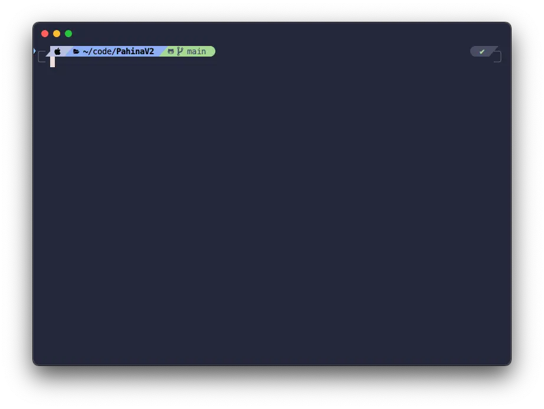
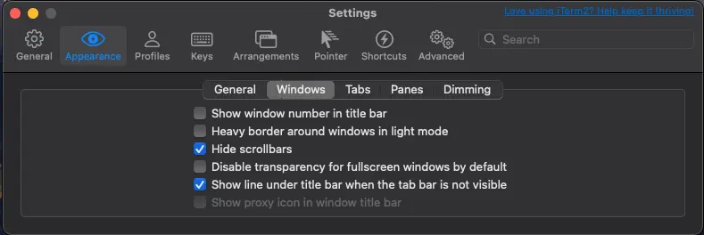

This guide will walk you through how I setup my terminal in macOs. The terminal is an integral part of my workflow and I have a list of tools that I have been using for years. And since setting up my environment usually only happens once on a new machine, there are times where I forget how to set it up so this will serve as a reference for myself as well.

This is how your terminal will looks like by the end of this tutorial:


## Install the Essentials
Assuming you are following this guide to set up your new machine, the first thing you need to do is check for an OS update. Then, install [Homebrew](https://brew.sh). As of this writing, the Homebrew installation process will prompt you to also install the Xcode Command Line Tools, which are essential for this setup. After completing these steps, you should have the following tools installed:
* hombrew
* xcode commandline tool
* git (included in `xcode commandline tool`)

## Install iTerm2
My terminal of choice is [iTerm2](https://iterm2.com). While I don’t have a specific reason for choosing it, I’ve been using it for nearly my entire career, and it has served me well.

## Oh-my-zsh
`zsh` has been the default shell of macOS for years now and `oh-my-zsh` is the most popular framework for managing `zsh` configurations. It has a strong community of users who contribute plugins, themes, and improvements, offering a large ecosystem of tools and enhancements.
1. Follow the instructions on how to install [oh-my-zsh from the official website.](https://github.com/ohmyzsh/ohmyzsh)
2. To enhance it further, install [powerlevel10k prompt theme](https://github.com/romkatv/powerlevel10k). (I installed it using oh-my-zsh; follow steps 1 and 2.)
3. Install this font for PowerLevel10k: `brew install --cask font-meslo-for-powerlevel10k`. (We’ll activate this in the next section)
4. If your iTerm2 is open, quit and relaunch it to trigger the powerlevel10k initial setup proccess.
5. After powerlevel10k is installed, make a few color changes for the Catppuccin theme. Open the config located in `~/.p10k.zsh` and update the following:
    ```zsh
    POWERLEVEL9K_DIR_FOREGROUND=232
	POWERLEVEL9K_DIR_SHORTENED_FOREGROUND=240
	POWERLEVEL9K_DIR_ANCHOR_FOREGROUND=232
    ```

## Oh-my-zsh: Plugins
Oh-my-zsh comes with many [builtin plugins](https://github.com/ohmyzsh/ohmyzsh/wiki/Plugins). To enable a plugin, add it to the .zshrc file in the plugins=() section. Here are five plugins I use:
1. sudo - prefix your current or previous commands with `sudo` by pressing `esc` twice.
2. extract - extracts the archive file you pass it, and it supports a wide variety of archive filetypes.
3. kubectl - adds command completion
4. gcloud - adds command completion

Additionally, here are two third-party plugins I highly recommend:
1. [zsh-autosuggestion](https://github.com/zsh-users/zsh-autosuggestions/blob/master/INSTALL.md#oh-my-zsh) - Auto-completes CLI commands.
2. [zsh-syntax-highlighting](https://github.com/zsh-users/zsh-syntax-highlighting/blob/master/INSTALL.md#oh-my-zsh) - Highlights known commands

## Aesthetic Enhancements
If you’re like me and prefer the CLI over GUI, making your terminal aesthetically pleasing is a must. There are many themes to choose from for iTerm2, but my favorite is [Catppuccin](https://catppuccin.com). It’s simple, easy on the eyes, and available in almost all the tools I use.

1.  To install it, follow the instructions here: [iTerm2’s Catppuccin](https://github.com/catppuccin/iterm) (I am using the Macchiato flavor).
2.  Then open iTerm2’s Settings (`cmd + ,`) and set the following:
	* Appearance → General → Theme = Minimal
	* Appearance → Windows:
        
	* Profiles → Text → Font = MesloLGS NF
	* This is optional but I also like to update Key Mappings
		* Profiles → Keys → Key Mappings → Presets = Natural Text Editing

## Wrapping Up
Feel free to adjust any settings or add additional plugins as your workflow evolves. This setup is a solid foundation, but the beauty of terminal customization lies in its flexibility to adapt to your personal style and requirements. Happy coding!